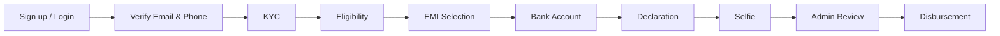

# EZFINANZ

A full-stack **personal loan application platform** where customers apply online through a guided 8-step flow, and admins review applications, verify selfies, and confirm disbursement.

Built for the [Personal Loan System Challenge](./Personal20SystemE29320220Challenge.md).

---

## Features

### Customer

- Sign up / log in with **email + password**, **phone OTP**, or **Google OAuth**
- Verify email and phone before continuing
- Complete **KYC** (identity, address, optional ID document upload)
- Run **loan eligibility** check (CIBIL score, income, debt-to-income)
- Select **EMI terms** with live calculation (interest, fees, GST, IRR, net disbursement)
- Add **bank account** for disbursement
- Accept **declaration**
- Submit **live selfie** for admin review
- Track application status on a responsive dashboard

### Admin

- Same login page, role-based routing to admin dashboard
- View all applications with stage, amount, tenure, and submission date
- Open full application detail (KYC, eligibility, EMI, bank, declaration, documents)
- Approve or reject selfie (with optional reason)
- Confirm loan disbursement

---

## Tech Stack

| Layer | Technology |
|-------|------------|
| Frontend | React 19, TypeScript, Vite, Tailwind CSS 4 |
| Backend | Java 21, Spring Boot 3.4, Spring Security, JWT |
| Database | PostgreSQL |
| Auth | BCrypt, JWT, Twilio SMS OTP, Gmail SMTP |
| OAuth | Google Sign-In |
| API docs | Springdoc OpenAPI (Swagger UI) |
| Files | Local filesystem (`uploads/`) |

See [TECH_STACK.md](./TECH_STACK.md) for architecture decisions.

---

## Project Structure

```
ezfinanz/
├── backend/                 # Spring Boot modular monolith
│   └── src/main/java/com/ezfinanz/
│       ├── auth/            # Login, OTP, Google OAuth, JWT
│       ├── kyc/             # Identity & address
│       ├── eligibility/     # Credit & income checks
│       ├── loan/            # EMI & IRR calculations
│       ├── bank/            # Disbursement account
│       ├── declaration/     # Terms acceptance
│       ├── selfie/          # Photo upload & review
│       ├── admin/           # Application review
│       └── customer/        # Dashboard API
├── frontend/                # React SPA
│   └── src/
│       ├── customer/        # 8-step application wizard
│       ├── pages/           # Landing, auth, admin
│       └── api/             # Typed REST client
└── Personal20SystemE29320220Challenge.md
```

---

## Prerequisites

- **Java 21**
- **Maven 3.9+**
- **Node.js 20+** (LTS recommended)
- **PostgreSQL 14+** running locally

---

## Getting Started

### 1. Clone the repository

```bash
git clone https://github.com/ManikantaReddi2273/ezfinanz.git
cd ezfinanz
```

### 2. Database

Ensure PostgreSQL is running. The backend auto-creates the `ezfinanz` database on startup if it does not exist.

Default connection (set in `backend/.env` — production uses **Supabase Postgres**):

| Variable | Example |
|----------|---------|
| `SPRING_DATASOURCE_URL` | `jdbc:postgresql://db.<ref>.supabase.co:5432/postgres?sslmode=require` |
| `SPRING_DATASOURCE_USERNAME` | `postgres` |
| `SPRING_DATASOURCE_PASSWORD` | your Supabase database password |

Files (KYC, selfies, knowledge docs) are stored in **Supabase Storage** bucket `ezfinanz-files` via `SUPABASE_URL` + `SUPABASE_SERVICE_ROLE_KEY` (or `SUPABASE_ANON_KEY`).

### 3. Backend

```bash
cd backend
cp .env.example .env
# Edit .env with your PostgreSQL, SMTP, JWT, OpenAI, Pinecone, Google, Twilio values
mvn spring-boot:run
```

API runs at **http://localhost:8080**

Swagger UI: **http://localhost:8080/swagger-ui.html**

Secrets live in `backend/.env` (gitignored). `application.properties` only references `${ENV_VAR}` placeholders so it is safe to commit. Use `backend/.env.example` as the template.

### 4. Frontend

Create `frontend/.env`:

```env
VITE_API_URL=http://localhost:8080
VITE_GOOGLE_CLIENT_ID=<your-google-client-id>
```

Then start the dev server:

```bash
cd frontend
npm install
npm run dev
```

App runs at **http://localhost:5173**

### 5. Default admin account

On first startup, an admin user is seeded from `.env`:

| Field | Variable |
|-------|----------|
| Email | `APP_ADMIN_EMAIL` |
| Password | `APP_ADMIN_PASSWORD` |

Customers and admins use the **same login page**; routing is based on role after authentication.

---

## Application Flow



**Eligibility rules (backend):**

- Loan range: ₹25,000 – ₹15,00,000
- Minimum monthly income: ₹15,000
- CIBIL bands: Excellent (750+), Good (700+), Fair (650+), Poor (&lt;650)
- Results: Eligible, Partially Eligible, or Not Eligible

**EMI tenures:** 6, 12, 18, 24, or 36 months with reducing-balance interest, processing fee, GST, and IRR.

---

## API Overview

| Endpoint prefix | Description |
|-----------------|-------------|
| `/api/auth/*` | Signup, login, OTP, profile, Google OAuth |
| `/api/kyc` | KYC save & document |
| `/api/eligibility` | Assess & retrieve eligibility |
| `/api/emi` | Quote & save EMI terms |
| `/api/bank` | Bank account |
| `/api/declaration` | Terms acceptance |
| `/api/selfie` | Photo submit & status |
| `/api/customer/dashboard` | Customer dashboard summary |
| `/api/admin/applications/*` | List, detail, approve/reject, disburse |

Protected routes require a Bearer JWT token.

---

## Build for Production

**Backend:**

```bash
cd backend
mvn clean package -DskipTests
java -jar target/ezfinanz-backend-0.1.0.jar
```

**Frontend:**

```bash
cd frontend
npm run build
npm run preview
```

Serve the `frontend/dist` folder with any static host and point `VITE_API_URL` to your deployed backend.

---

## Simulated vs Real Integrations

| Service | Approach |
|---------|----------|
| Email OTP | Real (Gmail SMTP) |
| Phone OTP | Real (Twilio SMS) |
| Google login | Real (OAuth 2.0) |
| KYC / PAN / Aadhaar | Simulated |
| CIBIL / credit score | Customer-entered; rules run in backend |
| Bank validation | Format checks only |

---

## License

This project was built as a technical challenge submission.
